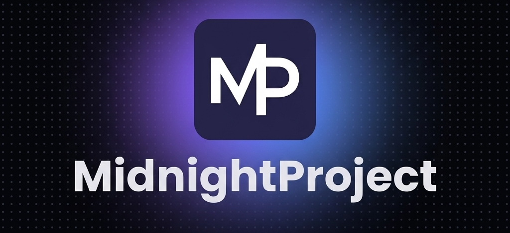

<p align="center">
  
</p>

<h1 align="center">MidnightProject</h1>

<p align="center">
  <sub>Официальный сайт команды MidnightProject</sub>
</p>

<p align="center">
  <a href="https://midnight-project.space"></a>
  <a href="https://discord.gg/heaqDH2uSD"></a>
  <a href="https://t.me/portcreator_ch"></a>
</p>

---

### О репозитории

Официальный сайт и лендинг **[MidnightProject](https://midnight-project.space)** - IT-команды энтузиастов, которая делает разные проекты для людей и интернета.

### Стек технологий

[](https://nextjs.org/)
[](https://react.dev/)
[](https://www.typescriptlang.org/)
[](https://github.com/css-modules/css-modules)

### Быстрый старт

```bash
git clone https://github.com/project-midnight/main-site.git
cd main-site
npm install
npm run dev
```

Сайт запустится на [localhost:3000](http://localhost:3000).

### Контрибьютинг

PR-ы и issue приветствуются. Если хочешь внести изменения - форкни репо и создай pull request.

### Лицензия

[Apache 2.0 License](LICENSE)

---

<p align="center">
  <sub>Made with 💜 by <a href="https://github.com/PortCreator">PortCreator</a> & <a href="https://midnight-project.space">MidnightProject</a></sub>
</p>
